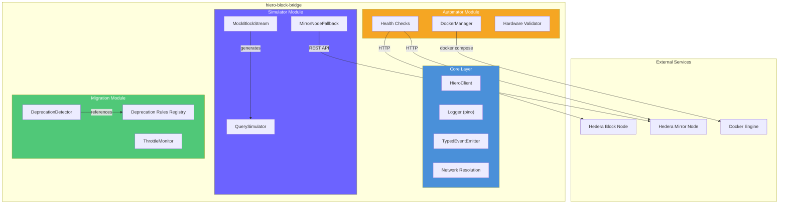

<p align="center">
  
</p>

<h1 align="center">HieroBlockBridge</h1>

<p align="center">
  <strong>A modular TypeScript library for simulating and automating Hedera Block Node access</strong>
</p>

<p align="center">
  <a href="https://github.com/U-GOD/hiero-block-bridge/actions/workflows/ci.yml"></a>
  <a href="https://www.npmjs.com/package/hiero-block-bridge"></a>
  <a href="https://www.npmjs.com/package/hiero-block-bridge"></a>
  <a href="https://codecov.io/gh/U-GOD/hiero-block-bridge"></a>
  <a href="./LICENSE"></a>
  <a href="https://github.com/U-GOD/hiero-block-bridge/blob/main/CONTRIBUTING.md"></a>
</p>

<p align="center">
  <a href="#installation">Installation</a> •
  <a href="#quick-start">Quick Start</a> •
  <a href="#modules">Modules</a> •
  <a href="#architecture">Architecture</a> •
  <a href="#api-reference">API Reference</a> •
  <a href="#contributing">Contributing</a>
</p>

---

## Overview

**HieroBlockBridge** enables Hedera developers to test and integrate [Block Node](https://hedera.com/blog/hedera-block-nodes-in-private-preview) features locally — without full self-hosting or waiting for third-party provider support. It bridges the gap during the 2025–2026 transition from legacy Mirror Nodes to the new Block Node architecture defined in [HIP-1056 (Block Streams)](https://hips.hedera.com/hip/hip-1056) and [HIP-1081 (Block Nodes)](https://hips.hedera.com/hip/hip-1081).

### Why HieroBlockBridge?

| Problem | Solution |
|---|---|
| Block Nodes are in phased rollout — providers don't support them yet | **Local Simulator** mocks Block Node endpoints with realistic data |
| Self-hosting a Block Node requires significant hardware and configuration | **Setup Automator** handles Docker bootstrapping and health checks |
| APIs are deprecating (e.g., `AccountBalanceQuery` removed July 2026) | **Migration Helpers** scan your code and suggest fixes automatically |
| No local testing path for Block Stream integrations | **Mock Streams** generate realistic block data at configurable intervals |
| Mirror Node → Block Node migration is opaque | **Auto-fallback** transparently routes queries during the transition |

> [!NOTE]
> This project is built for the [Hedera Hello Future Apex Hackathon 2026](https://hellofuturehackathon.dev) — Hiero bounty. It is designed as a **reusable, production-minded library** (not a demo app) following open-source best practices.

---

## Features

-  **Block Stream Simulator** — Mock HIP-1056 Block Streams locally with configurable intervals, transaction types, and failure injection
-  **Query Simulator** — Simulate Block Node queries (`getBlock`, `getTransaction`, `getStateProof`, `getAccountBalance`)
-  **Mirror Node Fallback** — Auto-fallback to Hedera Mirror Node REST API when Block Node is unavailable
-  **Setup Automator** — Docker tooling to spin up local Block Nodes with health monitoring
-  **Deprecation Detector** — Scan your codebase for deprecated Hedera APIs with auto-fix suggestions
-  **Throttle Monitor** — Track API usage rates against known Hedera throttle limits
-  **Health Checks** — Monitor Block Node and Mirror Node availability with exponential backoff
-  **Hardware Validator** — Check system resources against HIP-1081 Block Node minimum specs

---

## Installation

### Prerequisites

- **Node.js** ≥ 20 LTS
- **npm** ≥ 10 (or yarn/pnpm)
- **Docker** (optional — only for Setup Automator)

### Install

```bash
npm install hiero-block-bridge
```

```bash
# or with yarn
yarn add hiero-block-bridge

# or with pnpm
pnpm add hiero-block-bridge
```

---

## Quick Start

### 1. Start a Mock Block Stream

Generate realistic block data matching Hedera's ~2-second block interval:

```typescript
import { MockBlockStream, createLogger } from 'hiero-block-bridge';

const stream = new MockBlockStream({
  blockIntervalMs: 2000,
  transactionsPerBlock: 5,
  startBlockNumber: 0,
  failureRate: 0,
}, createLogger({ level: 'info' }));

stream.on('block', (block) => {
  console.log(`Block #${block.header.number}`);
  console.log(`  Hash: ${block.header.hash}`);
  console.log(`  Items: ${block.items.length}`);
});

stream.on('transaction', (tx) => {
  console.log(`  TX ${tx.transactionId}: ${tx.type} → ${tx.result}`);
});

await stream.start();

// Stop after 10 seconds
setTimeout(() => stream.stop(), 10_000);
```

### 2. Query Simulated Block Node Data

Feed streamed blocks into the query engine for Block Node-style queries:

```typescript
import { MockBlockStream, QuerySimulator, createLogger } from 'hiero-block-bridge';

const logger = createLogger({ level: 'info' });
const stream = new MockBlockStream({ blockIntervalMs: 500, transactionsPerBlock: 3 }, logger);
const query = new QuerySimulator({ stream, logger });

await stream.start();
await new Promise((r) => setTimeout(r, 3000)); // Generate some blocks
await stream.stop();

// Query by block number (returns Result<Block, HieroBridgeError>)
const blockResult = query.getBlock(0);
if (blockResult.ok) {
  console.log(`Block #0 hash: ${blockResult.value.header.hash}`);
}

// Query account balance
const balance = query.getAccountBalance('0.0.2');
if (balance.ok) {
  console.log(`Balance: ${balance.value.balanceTinybars} tinybars`);
}

// Get stats
const stats = query.getStats();
console.log(`Total blocks: ${stats.totalBlocks}, Total TXs: ${stats.totalTransactions}`);
```

### 3. Scan for Deprecated APIs

Detect deprecated Hedera API usage in your project before breaking changes hit:

```typescript
import { DeprecationDetector } from 'hiero-block-bridge';

const detector = new DeprecationDetector({
  minSeverity: 'warning',
  referenceDate: new Date(),
});

// Scan a directory
const report = await detector.scanDirectory('./src');

console.log(`Files scanned: ${report.filesScanned}`);
console.log(`Matches: ${report.totalMatches}`);
console.log(`  Errors: ${report.counts.error}`);
console.log(`  Warnings: ${report.counts.warning}`);

for (const match of report.matches) {
  console.log(`\n${match.severity.toUpperCase()} ${match.file}:${match.line}:${match.column}`);
  console.log(`  ${match.rule.id} — ${match.rule.api}`);
  console.log(`  Fix: ${match.replacement}`);
}

// Or format as a CLI-friendly report
console.log(DeprecationDetector.formatReport(report));
```

---

## Modules

HieroBlockBridge is organized into focused modules:

### Core

SDK client wrapper, typed event system, structured logging, and network configuration.

```typescript
import { HieroClient, createLogger, TypedEventEmitter } from 'hiero-block-bridge';

const client = new HieroClient({
  network: 'testnet',
  operatorId: process.env.HEDERA_ACCOUNT_ID,
  operatorKey: process.env.HEDERA_PRIVATE_KEY,
});

await client.connect();
const info = client.getNetworkInfo();
console.log(`Connected to ${info.network}`);
```

### Simulator

Mock Block Node endpoints locally for development and testing.

```typescript
import { MockBlockStream, QuerySimulator, MirrorNodeFallback, createLogger } from 'hiero-block-bridge';

// Stream → blocks are automatically indexed by QuerySimulator
const logger = createLogger({ level: 'silent' });
const stream = new MockBlockStream({ blockIntervalMs: 1000 }, logger);
const query = new QuerySimulator({ stream, logger });

// Mirror Node fallback for data not in the simulator
const fallback = new MirrorNodeFallback({ network: 'testnet', logger });

fallback.on('mirrorQuery', (event) => {
  console.log(`Fallback query: ${event.endpoint}`);
});
```

### Automator

Docker management, health checks, and hardware validation for Block Node environments.

```typescript
import { DockerManager, checkHardware, waitForReady, formatHardwareReport } from 'hiero-block-bridge';

// Validate hardware meets HIP-1081 specs
const report = await checkHardware();
console.log(formatHardwareReport(report));

// Manage Docker containers
const docker = new DockerManager({
  workDir: './local-node',
  projectName: 'my-block-node',
  grpcPort: 8080,
  restPort: 8081,
  mirrorPort: 5551,
});

await docker.generateCompose();
await docker.up();

// Wait for the Block Node to be ready
await waitForReady('http://localhost:8081', { timeoutMs: 60_000 });
```

### Migration

Detect deprecated APIs and monitor throttle limits.

```typescript
import {
  DeprecationDetector,
  ThrottleMonitor,
  DEPRECATION_RULES,
  getActiveRules,
} from 'hiero-block-bridge';

// See all currently active deprecation rules
const active = getActiveRules();
for (const rule of active) {
  console.log(`${rule.id}: ${rule.api} — removed ${rule.removedAt}`);
}

// Monitor API throttle limits in real-time
const monitor = new ThrottleMonitor();

monitor.on('warning', (snapshot) => {
  console.log(`⚠ ${snapshot.limitId}: ${snapshot.utilizationPct.toFixed(1)}% utilization`);
});

monitor.on('exceeded', (snapshot) => {
  console.log(`✗ ${snapshot.limitId}: EXCEEDED — ${snapshot.currentRate}/${snapshot.maxRate} ops/s`);
});

monitor.start();

// Record operations as they happen
monitor.recordByType('CryptoTransfer');
monitor.recordByType('TokenMint', 5);
```

---

## Architecture



### Module Dependencies

```
Types (Zod schemas, Result monad, error codes)
  └── Core (HieroClient, Logger, EventEmitter, Network)
        ├── Simulator (MockBlockStream, QuerySimulator, MirrorNodeFallback)
        ├── Automator (DockerManager, Health, Hardware)
        └── Migration (DeprecationDetector, ThrottleMonitor)
```

---

## Deprecation Timeline

HieroBlockBridge tracks the following Hedera API deprecations:

| Rule ID | API | Deprecated | Removed | Severity | Auto-Fix |
|---|---|---|---|---|---|
| `HIERO-001` | `AccountBalanceQuery` | May 2026 | July 2026 | Warning | ✓ |
| `HIERO-002` | `AccountInfoQuery` | May 2026 | July 2026 | Warning | ✓ |
| `HIERO-010` | `TokenInfoQuery` | May 2026 | July 2026 | Warning | ✓ |
| `HIERO-030` | Record File v5 format | Jan 2026 | June 2026 | Error | ✗ |
| `HIERO-031` | `.getRecord()` | May 2026 | July 2026 | Warning | ✗ |
| `HIERO-040` | Entity creation throttle | Jan 2026 | Apr 2026 | Warning | ✗ |

> Run `new DeprecationDetector().scanDirectory('./src')` to check your project.

---

## API Reference

Full API documentation is generated with [TypeDoc](https://typedoc.org/):

```bash
npm run docs
```

### Key Exports

| Export | Module | Description |
|---|---|---|
| `MockBlockStream` | Simulator | Generates mock HIP-1056 block streams |
| `QuerySimulator` | Simulator | In-memory Block Node query engine |
| `MirrorNodeFallback` | Simulator | Auto-fallback to Mirror Node REST API |
| `DockerManager` | Automator | Docker Compose lifecycle management |
| `checkHardware` | Automator | HIP-1081 hardware validation |
| `checkBlockNodeHealth` | Automator | Block Node endpoint health check |
| `waitForReady` | Automator | Poll until endpoint is ready (backoff) |
| `DeprecationDetector` | Migration | Scan code for deprecated API usage |
| `ThrottleMonitor` | Migration | Track API rates vs throttle limits |
| `HieroClient` | Core | Managed Hedera SDK client wrapper |
| `createLogger` | Core | Pino-based structured logger factory |
| `TypedEventEmitter` | Core | Type-safe event emitter |

---

## Development

```bash
# Clone the repository
git clone https://github.com/U-GOD/hiero-block-bridge.git
cd hiero-block-bridge

# Install dependencies
npm install

# Run tests
npm test

# Run tests with coverage
npm run test:coverage

# Lint
npm run lint

# Type check
npm run typecheck

# Build
npm run build

# Generate docs
npm run docs
```

### Test Structure

```
tests/
├── unit/
│   ├── types/          # Zod schema validation (68 tests)
│   ├── core/           # Client, events, logger, network (39 tests)
│   ├── simulator/      # Mock stream, query sim, fallback (51 tests)
│   ├── automator/      # Docker, health, hardware (55 tests)
│   └── migration/      # Deprecation rules, detector, throttle (53 tests)
├── integration/
│   ├── simulator-e2e.test.ts   # Full stream → query flow (8 tests)
│   └── automator-e2e.test.ts   # Docker + health integration (4 tests)
└── fixtures/
    ├── mock-blocks.json
    ├── transactions.json
    └── deprecated-code-samples/
```

**Total: 306 tests across 19 test files.**

---

## Contributing

Contributions are welcome! Please read our [Contributing Guide](CONTRIBUTING.md) before submitting a PR.

1. Fork the repository
2. Create a feature branch (`git checkout -b feat/amazing-feature`)
3. Commit your changes (`git commit -s -m 'feat: add amazing feature'`)
4. Push to the branch (`git push origin feat/amazing-feature`)
5. Open a Pull Request

### Commit Convention

This project uses [Conventional Commits](https://www.conventionalcommits.org/):

- `feat:` — New features
- `fix:` — Bug fixes
- `test:` — Adding or updating tests
- `docs:` — Documentation changes
- `ci:` — CI/CD changes
- `chore:` — Maintenance tasks

---

## License

[MIT](LICENSE) © devFred

---

<p align="center">
  Built with ❤️ for the <a href="https://hellofuturehackathon.dev">Hedera Hello Future Apex Hackathon 2026</a>
</p>
